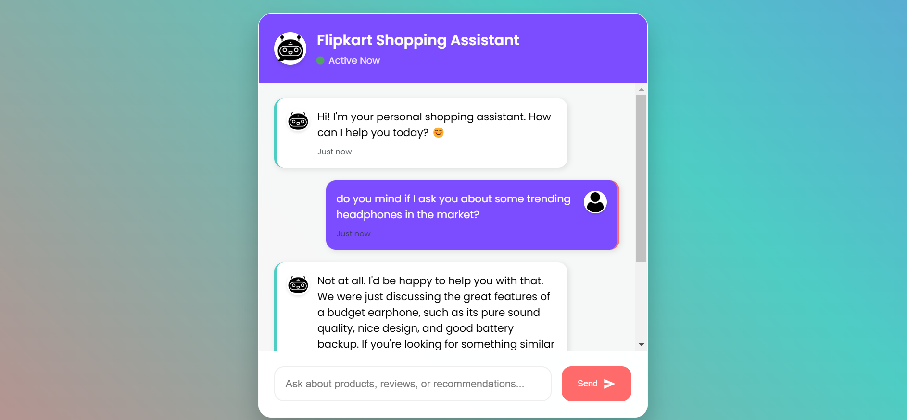

# 🛍️ AI Shopping Assistant

[](https://www.python.org/)
[](https://langchain.io/)
[](https://www.groq.com/)
[](https://flask.palletsprojects.com/)
[](https://www.datastax.com/products/datastax-astra)
[](https://www.docker.com/)
[](https://aws.amazon.com/)

An intelligent e-commerce chatbot powered by LangChain and Groq LLM, providing personalized product recommendations and handling customer queries through natural conversation.

## 🌟 [Live Demo]()



## 🎯 Key Features

- 🤖 Natural language product recommendations
- 💬 Context-aware conversation handling
- 🔄 Real-time response streaming
- 🎨 Modern, responsive UI design
- 🔒 Secure API handling
- 📊 Product review analysis
- 🚀 AWS cloud deployment
- 🐳 Docker containerization

## 🛠️ Technology Stack

### Core Components
- **LLM**: Groq (llama-3.3-70b-versatile)
- **Framework**: LangChain
- **Vector Store**: AstraDB
- **Backend**: Flask
- **Frontend**: HTML/CSS/JavaScript
- **Embeddings**: HuggingFace (BAAI/bge-base-en-v1.5)

### Cloud & DevOps
- **Cloud Platform**: AWS (ECR, EC2)
- **Containerization**: Docker
- **CI/CD**: GitHub Actions
- **Version Control**: Git

## 🚀 Quick Start

### Prerequisites
```bash
# Required environment variables
GROQ_API_KEY=your_groq_api_key
ASTRA_DB_API_ENDPOINT=your_astra_endpoint
ASTRA_DB_APPLICATION_TOKEN=your_astra_token
ASTRA_DB_KEYSPACE=your_keyspace
HF_TOKEN=your_huggingface_token
```

### Installation

1. **Clone Repository**
```bash
git clone <repository-url>
cd AI-Shopping-Assistant
```

2. **Create Virtual Environment**
```bash
conda create -p venv python==3.12
conda activate venv/
```

3. **Install Dependencies**
```bash
pip install -r requirements.txt
```

4. **Run Application**
```bash
python app.py
```

## 🏗️ Project Structure

```
AI-Shopping-Assistant/
├── flipkart/
│   ├── data_converter.py      # Data preprocessing
│   ├── data_ingestion.py      # Vector store management
│   └── retrieval_generation.py # Chat logic & LLM integration
├── static/
│   └── css/
│       └── style.css          # UI styling
├── templates/
│   └── index.html            # Chat interface
├── app.py                    # Flask application
├── Dockerfile               # Container configuration
└── requirements.txt         # Dependencies
```

## 🔄 Data Flow

1. User sends message through chat interface
2. Flask backend processes request
3. LangChain creates context-aware query
4. Vector store retrieves relevant product data
5. Groq LLM generates personalized response
6. Response streamed back to user interface

## 🚀 Deployment

### Local Deployment
```bash
docker build -t shopping-assistant .
docker run -p 5000:5000 shopping-assistant
```

### AWS Deployment
- Configure AWS credentials
- Set up ECR repository
- Configure GitHub Actions secrets
- Push to main branch for automatic deployment

## 🤝 Contributing

1. Fork the repository
2. Create feature branch (`git checkout -b feature/AmazingFeature`)
3. Commit changes (`git commit -m 'Add AmazingFeature'`)
4. Push to branch (`git push origin feature/AmazingFeature`)
5. Open Pull Request

## 📝 License

It is an Opensource application/Prject. You are allowed to use it for personal learning and use cases.

## 👥 Contact

Yunus Shaikh - [syunus838@gmail.com](mailto:syunus838@gmail.com)

Project Link: [https://github.com/yunus5603/AI-Shopping-Assistant](https://github.com/yunus5603/AI-Shopping-Assistant)

---

<p align="center">Made with ❤️ by Yunus Shaikh</p>

